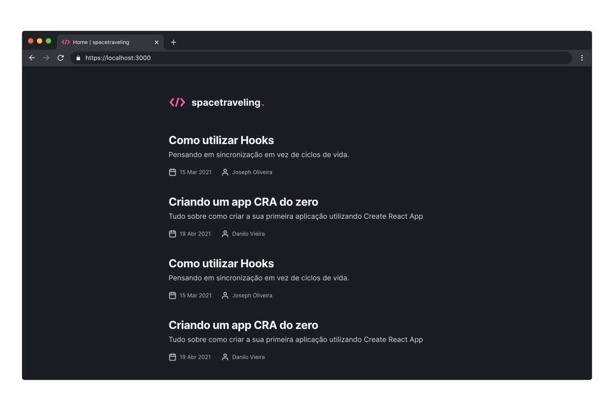

<h1 align="center">
  
</h1>

<p align="center">
  <a href="#-tecnologias">Tecnologias</a>&nbsp;&nbsp;&nbsp;|&nbsp;&nbsp;&nbsp;
  <a href="#-uso">Uso</a>&nbsp;&nbsp;&nbsp;|&nbsp;&nbsp;&nbsp;
  <a href="#-projeto">Projeto</a>&nbsp;&nbsp;&nbsp;|&nbsp;&nbsp;&nbsp;
  <a href="#-layout">Layout</a>&nbsp;&nbsp;&nbsp;|&nbsp;&nbsp;&nbsp;
  <a href="#-licença">Licença</a>
</p>

<p align="center">
  

  
</p>

<br>

<p align="center">
  
</p>

## 🧪 Tecnologias

Esse projeto foi desenvolvido com as seguintes tecnologias:

- TypeScript
- ReactJS
- NextJS
- SASS
- Prismic CMS
- Utterances

## 🚀 Uso

Clone o projeto na sua máquina:

```bash
git clone https://github.com/gutemberg-jhonata/spacetraveling.git
cd spacetraveling
```

Crie o arquivo .env.local na pasta do projeto, e execute o comando:

```bash
yarn dev
```

## 💻 Projeto

O spacetraveling é uma aplicação de notícias da tecnologia, desenvolvida durante o bootcamp Ignite, na trilha de ReactJS.

## 🔖 Layout

Você pode visualizar o layout do projeto através [desse link](https://www.figma.com/file/0Y26j0tf1K2WB5c1ja5hov/Desafios-M%C3%B3dulo-3-ReactJS). É necessário ter conta no [Figma](https://figma.com) para acessá-lo.

## :memo: Licença

Esse projeto está sob a licença MIT. Veja o arquivo [LICENSE](.github/LICENSE.md) para mais detalhes.
